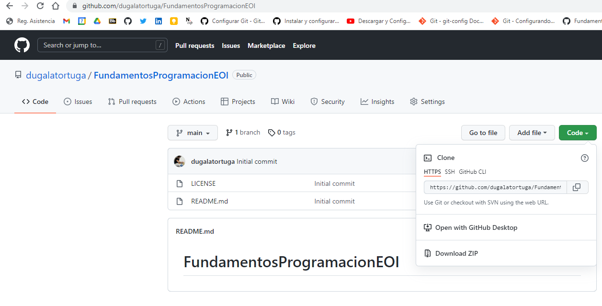
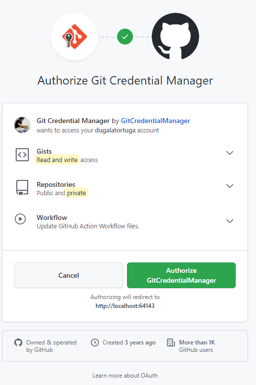
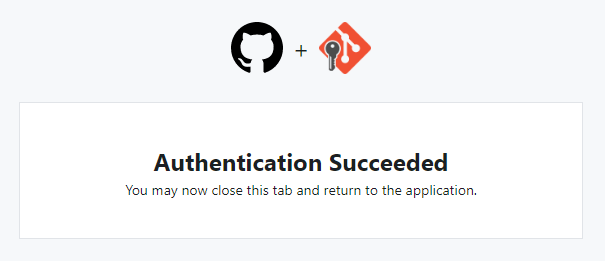

# Objetivos de la mañana del 07 de abril de 2022

1 - INSTALACIÓN DEL EDITOR MARKDOWN

[GUIA BREVE MARKDOWN](http://fobos.inf.um.es/R/taller5j/30-markdown/guiabreve.pdf)


...


2 - EXPLORACIÓN DE GITHUB

```


3 - EXPLORACIÓN DE GIT

  Descargar Git y dejarlo en la carpeta (no moverlo).

  Instalar Git y en el proceso de instalación dar siempre a "Siguiente" hasta que
  quede completamente instalado.

​			  https://git-scm.com/download/win


2. **(SOLO LA PRIMERA VEZ)** CREAR REPOSITORIO LOCAL CON GIT por primera vez 

   CONFIGURACION INICIAL 

   2.1 Crear una carpeta de trabajo

```
Comandos útiles:
c:> cd -- Cambia de carpeta, md -- crea carpeta, rd -- borra carpeta
    cls -- limpiar la ventana de command prompt
    
c:>MD 00-EOI (creamos la carpeta 00-EOI)
C:>CD 00-EOI (nos movemos a dicha carpeta)
```

​      2.2 Comprobamos que GIT esta instalado 

```
c:>git
```

​     2.3 Creamos un repositorio local

```
c:> git init 
Initialized empty Git repository in C:/00-EOI/.git/
```

​    2.4 Revisamos la configuración global al ordenador de GIT (La respuesta es
que no tiene configuración global) NO HACER CASO AL ERROR FATAL XD

```
c:>git config --global -l
fatal: unable to read config file 'C:/Users/WDAGUtilityAccount/.gitconfig': No such file or directory
```

​    2.5 Establecemos el usuario y el correo electrónico

```
c:>git config --global user.name "dugalatortuga"
```

```
c:>git config --global user.email="gab2diegor@gmail.com" 

(NOTA: en caso de que no nos dé alguno de los dos datos, podemos introducirlo
manualmente en el archivo de texto que los contiene abriéndolo desde
el bloc de notas)
```

2.6 Comprobamos la configuración global previamente establecida

```
c:>git config --global -l
user.name=dugalatortuga
user.email=gab2diegor@gmail.com
```


3. Establecemos una conexión entre mi repositorio local y el repositorio remoto (GITHUB)

 ```
C:>git branch
<no muestra nada>
 ```


```
c:> git status
On branch master

No commits yet

Untracked files:
  (use "git add <file>..." to include in what will be committed)
        FICHEROMDVSCODE.md
        img/
```

Añadir nuestros ficheros al seguimiento

```
c:> git add .
```

Volvemos a pedir el status

```
c:> git status
On branch master
No commits yet
Changes to be committed:
  (use "git rm --cached <file>..." to unstage)
        new file:   FICHEROMDVSCODE.md
        new file:   img/00.png
        new file:   img/01.png
```

Confirmar nuestros cambios:

```
c:> git commit -m "Estableciendo los primeras pasos"
[master (root-commit) 5822109] Estableciendo los primeros pasos
 3 files changed, 196 insertions(+)
 create mode 100644 FICHEROMDVSCODE.md
 create mode 100644 img/00.png
 create mode 100644 img/01.png
```

Pedir el status por penultima vez

```
C:\00-EOI>git status
On branch master
nothing to commit, working tree clean
```

Enlazamos el repositorio local con el remoto

```
IR AL GITHUB -> COPIAR la ruta del repositorio de git
```



Establecemos la conexion

```
git remote add main https://github.com/dugalatortuga/FundamentosProgramacionEOI.git
```

NOTA:

Borrar la conexión al repositorio remto si es necesario:

```
git remote rm main
```

Consultar que repositorios remotos estan enlazados a nuestro repositorio local

```
git remote -v
```


### CONFIRMACION DEL USUARIO DE GITHUB



Finalización de la autorización




### BUCLE

 1 - Hacer las actualizaciones en los ficheros, imagenes, programas, carpetas y demás elementos de nuestro proyecto.

2 - Informar a git de los cambios:

```
c:><caperta del proyecto> git add .
```

3 - Actualizar nuestro repositorio LOCAL o Confirmación de los cambios.

```
c:><caperta del proyecto> git commit -m "<TEXTO CON LA OBSERVACION DE LA CONFIRMACION>"
```

4 - Actualizamos al remoto (NO LO VEREMOS EN GITHUB)

```
c:><caperta del proyecto> git push main
```

5 - Revisar el status

```
c:><caperta del proyecto>git status
```


Vuelta al No. 1. Repetiremos estos pasos cada vez que queramos actualizar nuestro repositorio en la nube a partir del local.

Vuelta!


SUBIDA DE IMAGENES. Es importante empezar con exclamación, hacer
 referencias relativas, indicar el nombre de la imagen entre 
 corchetes y poner la barra correcta, la del 7.


confirmamos los cambios
git commit -m "<confirmamos la subida de imagenes>"


### PRUEBA DE INSERCIÓN git add .


__ACTUAZAMOS LOS ARCHIVOS DEL REPOSITORIO__

1. Empezamos incluyendo los cambios realizados (con este comando los cambios se quedan estancados en stage)

git add .

2. Verificamos que los cambios estánn OK

git status

3. Damos nombre a la actualización realizada poniéndole un nombre entre las comilllas

git commit -m "..."

4. Pasamos los cambios del stage a la nube

git push main

5. Comprobamos de nuevo que los cambios se han aplicado correctamente

git status


VOLVEMOS A INICIAR LOS 5 PUNTOS TANTAS VECES COMO LO NECESITEMOS.


### PARA CONECTAR EL REPOSITORIO LOCAL CON LA NUBE

git remote add main (y el link del repositorio)

git remote -v para comprobar que la conexión es buena

git push main para conectar


           ## FIN
(comprobación de actualización)

**ERROR EN LA SUBIDA DE IMAGENES. PENDIENTE DE REVISIÓN.

