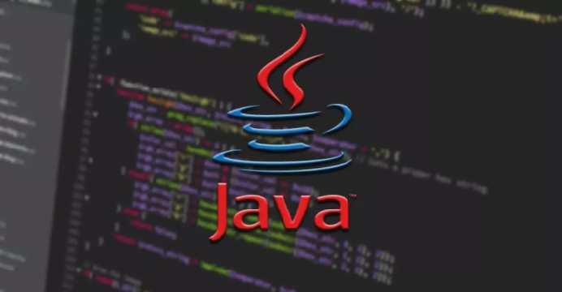
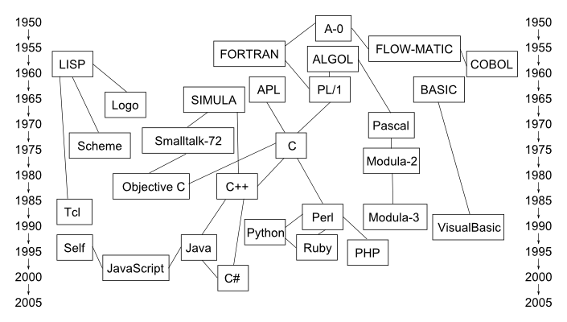
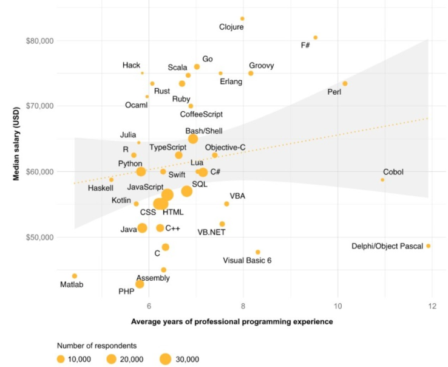
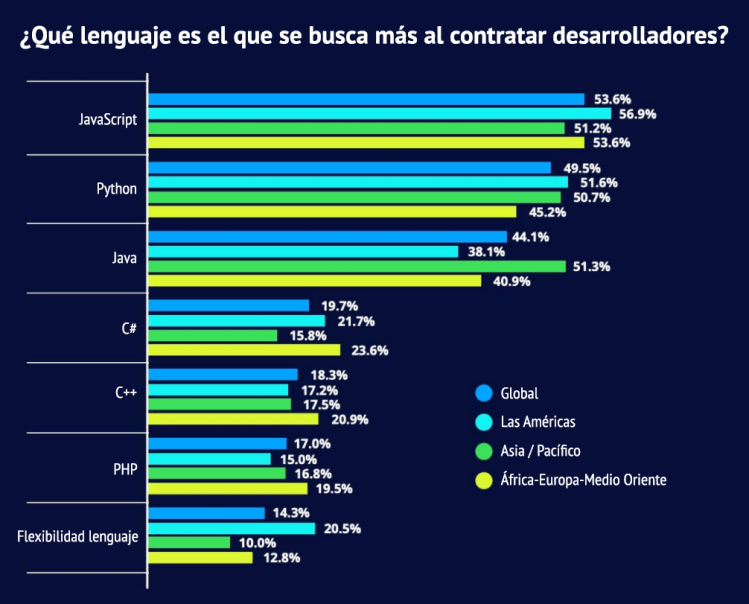
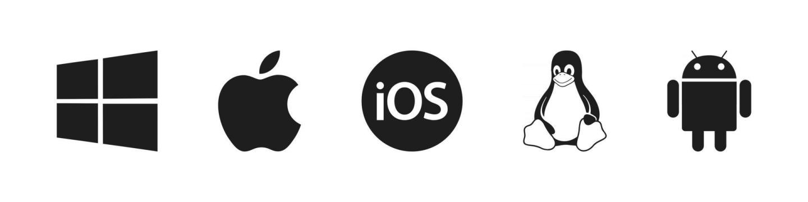

# JAVA #

__Historia__

Para hablar de la historia de java, primero debemos remontarnos a los años 80, donde C podía considerarse el lenguaje por antonomasia. Era un lenguaje versátil, que podía actuar a bajo nivel y resolvían problemas muy complejos. Era la cima de la programación estructurada, para resolver estos complejos algoritmos, se generaban grandes procedimientos con un código muy complicado de mantener a largo plazo. Por ello empezó a surgir como alternativa la programación orientada a objetos, y con ella nació C++.
Java nace en 1991 con el nombre "OAK", posteriormente cambiado por Green por problemas legales, y finalmente con la denominación actual JAVA. Hay varias teorías que hablan de cómo eligieron el nombre del lenguaje, y es que, según cuentan, los desarrolladores tomaban café habitualmente en una cafetería del mismo nombre, por eso utilizaron como logo una taza de café humeante. Otra teoría dice que viene del acrónimo "Just Another Vague Acronym" (otro acrónimo ambiguo más).

El objetivo de Java era crear un lenguaje de programación parecido a C++ en estructura y sintaxis, fuertemente orientado a objetos, pero con una máquina virtual propia.
Esto se hizo bajo el principio, de poder ser usado bajo cualquier arquitectura "Write Once, Run Anywhere" (escribe una vez, ejecútalo en cualquier sitio)". En 1992 se presenta el proyecto Green con prototipos a bajo nivel.
Lo que se buscaba era la creación de funciones mediante este “idioma”, que posteriormente pudieran ser aplicadas en otros entornos virtuales compatibles sin necesidad de crear desde cero la misma codificación.
En el transcurso de los meses de junio y julio del año 1994, el equipo de profesionales desarrolló una plataforma Java basada en una máquina virtual y un lenguaje muy similar a C++. Al mismo tiempo se desarrolló un navegador compatible, HotJava.
No solo serviría en navegadores propios de HotJava, sino también en los de Netscape.

En el año 1996, la propia Sun Microsystems creó el grupo empresarial JavaSoft, orientada exclusivamente al desarrollo tecnológico de este lenguaje de programación.

Desde entonces hasta la actualidad, Java ha pasado desde su versión inicial JDK 1.0 hasta la Java 8 Update 291 que se implementó el 20 de abril de 2021.

Los programas largos son difíciles de organizar y de leer. Un programa completo tiene muchas líneas de código y tratar de encontrar una parte específica puede llegar a ser complicado. En este sentido, se puede trabajar de forma modular. En Java se pueden crear módulos que simplifican la tarea que estamos programando.

Características:

Multiplataforma.

- Lenguaje orientado a objetos: El enfoque orientado a objetos es uno de los estilos de programación más popular. En la programación orientada a objetos, un problema complejo se divide en conjuntos más pequeños mediante la creación de objetos. Esto hace que el código sea reutilizable, tenga beneficios de diseño y haga que el código sea más fácil de mantener.

- Rapidez: las versiones anteriores de Java fueron criticadas por ser lentas. Sin embargo, las cosas son completamente diferentes ahora. Las nuevas JVM son significativamente más rápidas. Y, la CPU que ejecuta JVM también se vuelve cada vez más poderosa. Ahora, Java es uno de los lenguajes de programación más rápidos. El código Java bien optimizado es casi tan rápido como los lenguajes de nivel inferior como C/C ++, y mucho más rápido que Python, PHP, etc.

    - Seguridad: la plataforma Java proporciona varias características para la seguridad de las aplicaciones Java. Algunas de las características de alto nivel que maneja Java son:
        1. Proporciona una plataforma segura para desarrollar y ejecutar aplicaciones
        2. Administración automática de memoria, reduce la corrupción de la memoria y vulnerabilidades
        3. Proporciona comunicación segura al proteger la integridad y privacidad de los datos
        transmitidos

    - Amplio conjunto de Bibliotecas: una de las razones por las que Java es ampliamente utilizado es debido a la disponibilidad de una gran biblioteca estándar. El entorno Java tiene cientos de clases y métodos en diferentes paquetes para ayudar a los desarrolladores de software como nosotros. Por ejemplo:

        - Aplicaciones de Android: el lenguaje de programación Java que usa Android SDK (Kit de desarrollo de software) generalmente se usa para desarrollar aplicaciones de Android.
        - Aplicaciones web: Java se usa para crear aplicaciones web a través de Servlets, Struts o JSPs. Algunas de las aplicaciones web populares escritas en Java son: Google.com, Facebook.com, eBay.com, LinkedIn.com, etc.
        Desarrollo de software – Softwares como Eclipse, OpenOffice, Vuze, MATLAB, etc. usan Java.
        - Procesamiento de Big Data: puede utilizar un marco de software popular como Hadoop (que a su vez está escrito en Java) para procesar Big Data. Para usar Hadoop, debe comprender la programación de Java.
        - Sistema de negociación: puede crear aplicaciones de negociación que tengan baja latencia utilizando Oracle Extreme Java Trading Platform.
        - Dispositivos incorporados: si bien los lenguajes de programación C/C ++ siguen siendo opciones populares para trabajar con sistemas integrados, las tecnologías Java Embedded de Oracle proporcionan plataforma y tiempo de ejecución para miles de millones de dispositivos integrados como: televisores, tarjetas SIM, reproductores de discos Blu-ray, etc.
        - Además de estas aplicaciones, Java también se utiliza para el desarrollo de juegos, aplicaciones científicas (como el procesamiento del lenguaje natural) y muchas otras.

__Compilado/Interpretado/Híbrido__

Híbrido: Java es un lenguaje particular porque es compilado, pero es compilado a un lenguaje intermedio llamado bytecode, que después es interpretado, por tanto es híbrido.

__Plabras clave__

Lista de palabras clave (keywords) del lenguaje Java

Palabra     Descripción de su funcionalidad

| Comando | Descripción |
| ------- | ----------- |
|__abstract__|_Se utiliza para definir clases y métodos abstractos._|
|__extends__ |_Cláusula que permite indicar la clase padre de una clase._|
|__class__| _Sirve para definir una clase._|
|__this__|	_Se utiliza para referenciar al objeto actual, así como para invocar a un constructor de la clase a la que pertenece dicho objeto._|
|__new__| _Operador que se utiliza para crear un objeto nuevo de una clase._|
|__static__| _Permite especificar que un elemento es único en una clase, no pudiendo existir.instancias de esa clase que contengan a dicho elemento._|
|__void__| _Tipo de dato vacío (sin valor)._|
|__import__| _Permite importar un paquete (package)._|
|__public__| _Modificador de acceso para indicar que un elemento es accesible desde cualquier clase._|
|__package__| _Agrupa a un conjunto de clases._|
|__protected__| _Modificador de acceso para indicar que un elemento es accesible desde la clase donde se ha definido, subclases de ella y otras clases del mismo paquete (package)._|
|__assert__|_Sirve para afirmar que una condición es cierta._|
|__boolean__| _Tipo de dato primitivo booleano (lógico), que puede ser true o false._|
|__break__|_Instrucción de salto que interrumpe (rompe) la ejecución de un bucle o de una instrucción de control alternativa múltiple (switch)._|
|__switch__|_Instrucción de control alternativa múltiple._|
|__case__|_Caso de una instrucción de control alternativa múltiple (switch)._|
|__default__|_Caso por defecto de una instrucción de control alternativa múltiple (switch)._|
|__enum__|_Sirve para definir tipos de datos enumerados._|
|__byte__|_Tipo de dato primitivo número entero (integer) de 8 bits._|
|__double__|_Tipo de dato primitivo número real en coma flotante con precisión doble (double-precision floating-point) de 64 bits._|
|__float__|_Tipo de dato primitivo número real en coma flotante con precisión simple (single-precision floating-point) de 32 bits._|
|__long__|_Tipo de dato primitivo número entero (integer) de 64 bits._|
|__char__|_Tipo de dato primitivo carácter (valor Unicode) de 16 bits._|
|__continue__|_Instrucción de salto que interrumpe (rompe) la ejecución de la iteración de un bucle. Pero, permitiendo continuar al bucle seguir realizando otras iteraciones._|
|__do__|_Se usa en la sintaxis de un bucle hacer mientras (do while)._|
|__for__|_Instrucción de control repetitiva "para"._|
|__while__|_Se usa para escribir bucles mientras (while) y bucles hacer mientras (do while)._|
|__try__|_Permite especificar un bloque de código donde se quieren atrapar excepciones._|
|__throws__|Sirve para indicar las excepciones que un método puede lanzar._|
|__if__|_Se emplea para escribir instrucciones de control alternativas simples (if) o dobles (if else)._|
|__else__|_Si no, en una instrucción de control alternativa doble (if else)_.|
|__throw__|_Permite lanzar una excepción_|

__Sensible a mayuscula y minuscula__

Sí es sensible: por ejemplo en lenguajes C, C++ y JAVA no es lo mismo escribir un nombre de una variable en mayúsculas que en minúsculas.

__Remuneración__

El salario desarrollador Java promedio en España es de € 31.500 al año o € 16,15 por hora. Los cargos de nivel inicial comienzan con un ingreso de € 25.125 al año, mientras que profesionales más experimentados perciben hasta € 40.500 al año.

__Tamaño de la comunidad__

Sobre el uso de Java: a principios de siglo se contabilizó su presencia en unos 2.500 millones de dispositivos tecnológicos y su dominio por parte de unos 4,5 millones de profesionales. Con el crecimiento de Android, Java se convirtió en uno de los lenguajes más extendidos.

__Influencia de otros lenguajes__

La sintaxis de JAVA esta muy influenciada por los lenguajes C y C++ pero a diferencia de C++ el cual combina una sintaxis para programación estructural, genérica y orientado a objetos, JAVA esta construido casi exclusivamente hacia la programación orientada a objetos.

__Multiplataforma__

El lenguaje de JAVA es multiplataforma y funciona en todas las plataformas que tengan JVM (Java Virtual Machine). Todos los Sistemas Operativos actuales Windows, Mac OS y Linux lo soportan.

