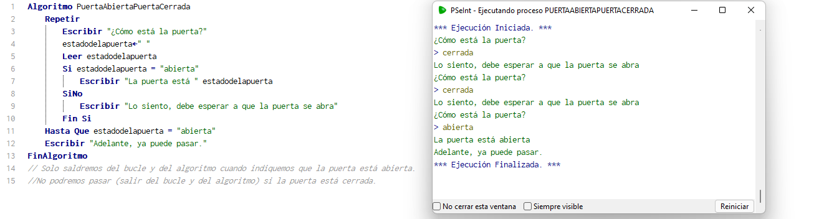

**Mi primer algoritmo.**

El presente programa nos dejará acceder a una habitación cuando la puerta esté abierta. Si la puerta está cerrada no podremos pasar.
```
AAlgoritmo PuertaAbiertaPuertaCerrada
	Escribir "¿Cómo está la puerta?"
	Repetir
		estadodelapuerta<-" "
		Leer estadodelapuerta
		Si estadodelapuerta = "abierta"
			Escribir "La puerta está " estadodelapuerta
		SiNo
			Escribir "Lo siento, debe esperar a que la puerta se abra"
		Fin Si
	Hasta Que estadodelapuerta = "abierta"
	Escribir "Adelante, ya puede pasar."
FinAlgoritmo
// Solo saldremos del bucle y del algoritmo cuando indiquemos que la puerta está abierta.
//No podremos pasar (salir del bucle y del algoritmo) si la puerta está cerrada.
```
Prueba de escritorio:
